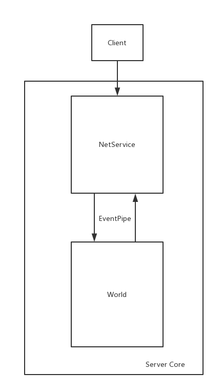

## OpenGS

OpenGS is an open source, cross platform online game server, developed in C++ and lua, and can run on windows, macos, linux.

## Topology

Main framework:  

In the Server Pack, every server connect to other server directly.  

Server core:  

## Depend

CMake  
Lua 5.2 or 5.3  
Libevent 2  
Mysql Connector C  
Tinyxml2  
Lfs  

win64 Libs in [here](https://github.com/mashago/Libs), please copy dir 'lib' and 'include' to $PROJECT_DIR.  
copy libmysql.dll to $PROJECT_DIR/bin when build as debug project in win64.

## Build

`cmake .`

## Run
run on centos or macos
1. build db
`cd conf`
`mysql -uroot -p < conf/db_login_init.sql`
`mysql -uroot -p < conf/db_game_init.sql`
`cd $PROJECT_DIR/bin`
`./sync_db.sh`
2. startup server
`./run.sh`
3. run client
`./run_client.sh`

## Test
In MassNetClient, enter 'help'.

